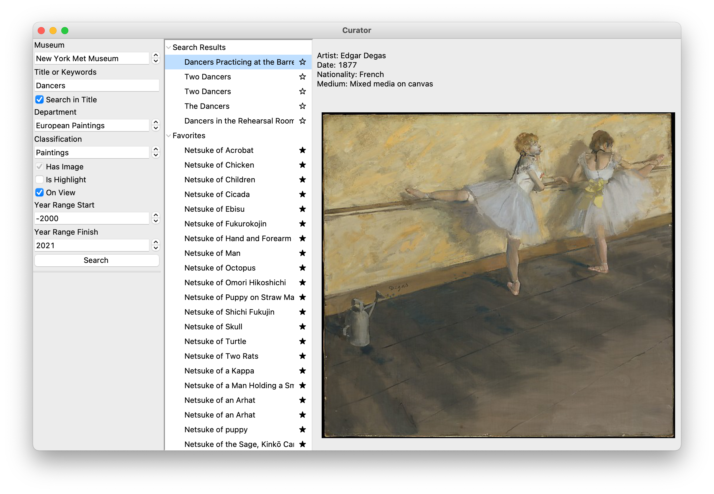

# Curator, an app for accessing the Met Museum collection

This project explores how the New York Met Museum's [Open Access API](https://www.metmuseum.org/blogs/now-at-the-met/2018/met-collection-api) might be used in curating a sort of remote exhibition.

The Met Museum Curator application will allow a user to search the New York Metropolitan Museum collection for art and display images of objects in the collection.  The query is performed over rest using an api provided by the museum.  The initial query returns a list of object ids, and a second query must be performed for each object to retrieve the details about the object, including locations of images.  The object id, title, artist, and url for the main image can be saved to a local database.  An image is displayed by using the saved url to perform a third query to retrieve the image. 

The graphical interface, written in Python using Tkinter, is shown below.  The left panel contains controls for setting query parameters.  The middle pane shows the titles of objects returned by a search, as well as those that have been saved as favorites.  Selecting an item from the results list displays the main image for that art object and select details in the pane on the right.

Note: Install required python modules using `pip3 install requirements.txt`.  Launch app using `python3 curatorApp.py`
